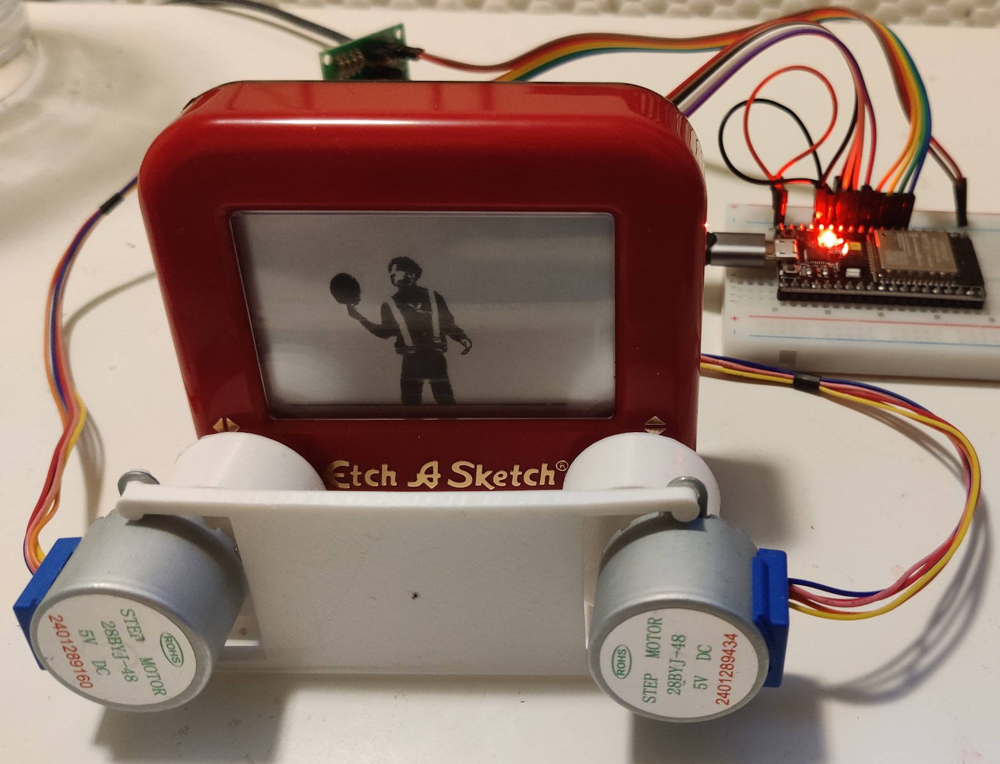

# etch-a-sketch-3D-bot
A 3D printed bot for drawing with Etch-A-Sketch

## Hardware
2x stepper motor
I'm using 28BYJ-48, which just works but I don't recommended it because:
1. it's very slow (10 rpm to prevent step losses)
2. inaccurate (check out the movement compensation code in `serial_write.py`)

## 3D printed connecter and frames
The 3D printing files and design pictures are in the `3D_parts` folder. 
The stepper_knob connector connects the stepper motor and the knobs.  
  
The frame fixs the position of the two stepper motors.  
  

## Arduino
Code are in `stepper_oneRevolution`, will read intructions from serial port.

## Control code
* `route_planner.py` is a very simple dfs planner, will generate many redundant steps, but it works
* `serial_write.py` send the steps to Arduion and drive the moter.

## Todo (maybe never)
1. store the data in on-board flash so that it doesn't need to be connected to a PC all the time
2. support bluetooth or wifi (w/ esp32)
3. better route planner
4. better stepper motors
